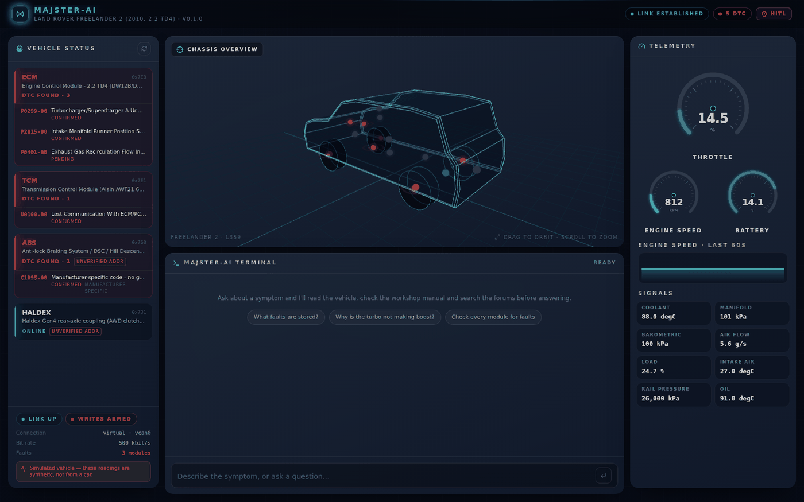

# Majster-AI Cyber-HUD

The web interface for the Majster-AI diagnostic agent: an interactive 3D
automotive telemetry workstation.



## Running it

The frontend is one half of a pair — it needs the FastAPI backend for its data.

```bash
# terminal 1 — the API and WebSocket
majster-ai web            # http://127.0.0.1:8000

# terminal 2 — the Vite dev server, proxying /api and /ws to the backend
cd frontend
npm install
npm run dev               # http://localhost:5173
```

For a single-origin deployment, build once and let the backend serve it:

```bash
cd frontend && npm run build
majster-ai web            # now serves the UI at http://127.0.0.1:8000
```

## What's in it

| Component | What it does |
|---|---|
| `vehicle/Vehicle3DViewer` | R3F holographic chassis. Module pins sit at real vehicle coordinates; clicking a fault code lerps the camera to that component. |
| `vehicle/geometry` | The extruded SUV silhouette, wheel placements, and the module→3D-position map — including which wheel a chassis DTC belongs to. |
| `RadialGauge` | SVG gauges with spring-interpolated needles and threshold-driven colour. |
| `HitlSecuritySlider` | Drag-to-authorize for vehicle writes, with elastic snap-back. |
| `MasterAgentChat` | The terminal: live tool-call stream, typewriter reveal, expandable citations. |
| `VehicleStatusPanel` | Module health and the fault list that drives the 3D view. |
| `TelemetryPanel` | Gauges, live trace, and the full signal readout. |
| `hooks/useDiagnostics` | The single WebSocket connection: reconnection, typed frame dispatch, all live state. |
| `types/protocol.ts` | Mirrors `majster_ai/web/protocol.py`. Keep the two in step. |

## Design notes

**Fonts are system stacks, not webfonts.** This runs in workshops with no
signal; a font that fails to load is worse than one never requested. The
"cyber-deck" feel comes from weight, tracking and colour.

**Panels are mostly opaque.** A heavily translucent panel depends on
`backdrop-filter` to be legible at all, and that is the property browsers
composite least predictably — under software rendering the layered stack washes
out into a pale smear. The blur is an enhancement, not a load-bearing
dependency.

**The approval modal is not animated out.** With an exit animation it reliably
faded to `opacity: 0` and then stayed mounted, leaving an invisible
`fixed inset-0` sheet that swallowed every click in the app. A 180 ms fade-out
is not worth that failure mode.

**Motion respects `prefers-reduced-motion`.** The sonar pings, the sweep and
the typewriter all collapse to their end state.

## Safety

The slider sends one boolean. The credential that actually authorises a write
is created and redeemed inside the server process and never appears in any
frame — see [docs/SAFETY.md](../docs/SAFETY.md). If this component had a bug,
the worst it could do is fail to ask.

## Scripts

```bash
npm run dev        # dev server on :5173, proxying to the backend on :8000
npm run build      # typecheck + production bundle into dist/
npm run preview    # serve the built bundle
npm run lint       # eslint
npm run typecheck  # tsc only
```
